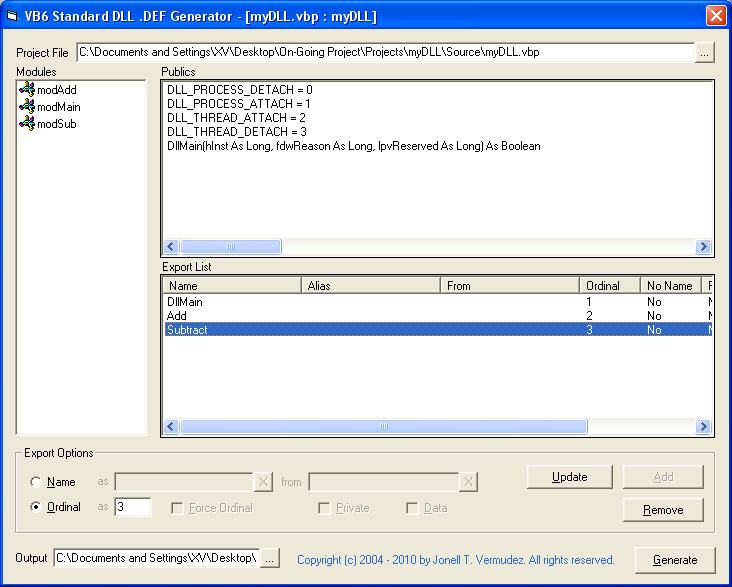



## VB6 Standard DLL \.def Generator \[Update 12\-15\-2010\!\]

### Description

This makes it possible to create your favorite functions into a standard DLL from within VB6!

Generates export list for your public functions and subs etc and dumps the file as .def for linking with your DLL project. Updated to fix path of module (with or without path) and added some export list beautifiers in the output .def file. (Now supports methods without the Public in declarations!)
 
### More Info
 

             |
---                |---
**Submitted On**   |2010-12-13 05:38:08
**By**             |[Jonell T\. Vermudez](https://github.com/Planet-Source-Code/PSCIndex/blob/master/ByAuthor/jonell-t-vermudez.md)
**Level**          |Intermediate
**User Rating**    |4.7 (28 globes from 6 users)
**Compatibility**  |VB 6\.0
**Category**       |[Libraries](https://github.com/Planet-Source-Code/PSCIndex/blob/master/ByCategory/libraries__1-49.md)
**World**          |[Visual Basic](https://github.com/Planet-Source-Code/PSCIndex/blob/master/ByWorld/visual-basic.md)
**Archive File**   |[VB6\_Standa21945712142010\.zip](https://github.com/Planet-Source-Code/jonell-t-vermudez-vb6-standard-dll-def-generator-update-12-15-2010__1-73485/archive/master.zip)

